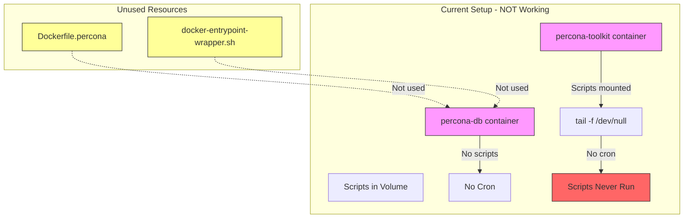

# Percona Scripts and Cron Configuration Analysis

**Date:** 2026-01-04  
**Status:** 🔴 Scripts available but cron NOT configured

## Executive Summary

Your Percona scripts **ARE available** in the toolkit container, but they are **NOT programmed to run automatically** with cron. There's a mismatch between your Docker Compose configuration and your custom Dockerfile.

## Current Setup Analysis

### Two-Container Architecture

Your [`docker-compose.percona.yml`](../examples/smartoys/percona/docker-compose.percona.yml:1) uses a **two-container setup**:

#### Container 1: percona-db
- **Image:** `percona/percona-server:8.0.44` (official image)
- **Purpose:** MySQL database server
- **Scripts:** ❌ NOT mounted
- **Cron:** ❌ NOT installed/configured
- **Status:** Running MySQL only

#### Container 2: percona-toolkit
- **Image:** `perconalab/percona-toolkit:latest` (official toolkit image)
- **Purpose:** Analysis tools
- **Scripts:** ✅ Mounted at `/opt/analysis:ro` from volume `mautic-db-scripts`
- **Cron:** ❌ NOT installed/configured
- **Command:** `tail -f /dev/null` (keeps container alive, does nothing)
- **Status:** Idle, no automation

### Available Scripts

Your scripts in [`examples/smartoys/percona/scripts/`](../examples/smartoys/percona/scripts/):

| Script | Purpose | Scheduled Time |
|--------|---------|----------------|
| [`setup-cron.sh`](../examples/smartoys/percona/scripts/setup-cron.sh:1) | Configure cron jobs | Manual execution needed |
| [`analyze-slow-queries.sh`](../examples/smartoys/percona/scripts/analyze-slow-queries.sh:1) | Daily slow query analysis | Should run at 2 AM UTC |
| [`analyze-indexes.sh`](../examples/smartoys/percona/scripts/analyze-indexes.sh:1) | Weekly index analysis | Should run Sunday 3 AM UTC |
| [`suggest-improvements.sh`](../examples/smartoys/percona/scripts/suggest-improvements.sh) | Weekly suggestions | Should run Sunday 4 AM UTC |
| [`restore-from-remote.sh`](../examples/smartoys/percona/scripts/restore-from-remote.sh:1) | Database restore utility | Manual execution |

### Unused Custom Build

You have a [`Dockerfile.percona`](../examples/smartoys/percona/Dockerfile.percona:1) that:
- ✅ Installs Percona Toolkit + cron
- ✅ Copies scripts to `/opt/analysis/`
- ✅ Sets up custom entrypoint with cron
- ❌ **NOT being used** by your docker-compose.yml

And a [`docker-entrypoint-wrapper.sh`](../examples/smartoys/percona/docker-entrypoint-wrapper.sh:1) that:
- ✅ Starts cron service
- ✅ Waits for MySQL readiness
- ✅ Runs setup-cron.sh automatically
- ❌ **NOT being used** by your current setup

## The Problem



**Root Cause:** Your `docker-compose.percona.yml` uses official images instead of your custom-built image with cron support.

## Verification Commands

Check if scripts are accessible in toolkit container:
```bash
docker exec percona-toolkit ls -la /opt/analysis/
```

Check if cron is installed in toolkit container:
```bash
docker exec percona-toolkit which cron
# Expected: Will likely fail - cron not installed
```

Check if cron is running:
```bash
docker exec percona-toolkit service cron status
# Expected: Will fail - service not available
```

## Impact Assessment

### What Works ✅
- Database is running with slow query logging enabled
- Scripts are accessible in the toolkit container via volume mount
- You can run scripts manually

### What Doesn't Work ❌
- **No automated analysis** - scripts never run automatically
- **No cron configured** - neither container has cron set up
- **No scheduled reports** - daily/weekly analysis won't happen
- **Manual execution required** - you must run scripts yourself

## Solutions

### Option 1: Use Custom Dockerfile (Recommended)

Modify your database container to use the custom build with cron support.

**Pros:**
- Single container (simpler architecture)
- Cron automatically configured
- Scripts run on schedule
- Uses your existing Dockerfile.percona

**Cons:**
- Need to rebuild image
- Slightly larger image size

### Option 2: Add Cron to Toolkit Container

Keep two-container setup but install cron in toolkit container.

**Pros:**
- Separation of concerns maintained
- Database container remains standard Percona image

**Cons:**
- More complex setup
- Need to modify toolkit container entrypoint
- Scripts need network access to database

### Option 3: External Cron (Host-Based)

Run scripts from host machine using cron on your server.

**Pros:**
- No container modifications needed
- Easy to debug

**Cons:**
- Less portable
- Requires host system configuration
- Manual cron setup on each deployment

## Recommendations

### Immediate Action

Since you have a ready-to-use [`Dockerfile.percona`](../examples/smartoys/percona/Dockerfile.percona:1), I recommend **Option 1**:

1. Build your custom image
2. Update docker-compose.percona.yml to use it
3. Remove the separate toolkit container (not needed)
4. Cron will start automatically

### Alternative Quick Fix

If you want to test the scripts now without rebuilding:

```bash
# Run scripts manually in toolkit container
docker exec percona-toolkit /opt/analysis/analyze-slow-queries.sh

# Or exec into container and run setup-cron manually
docker exec -it percona-toolkit bash
# Then inside: install cron and run setup-cron.sh
```

But this won't persist across container restarts.

## Next Steps

Would you like me to:
1. **Create a plan to implement Option 1** (use custom Dockerfile with automated cron)?
2. **Create a plan to implement Option 2** (add cron to existing toolkit container)?
3. **Provide manual execution scripts** for running analysis on-demand?

The best long-term solution is Option 1, which uses your existing Dockerfile.percona and provides full automation.
