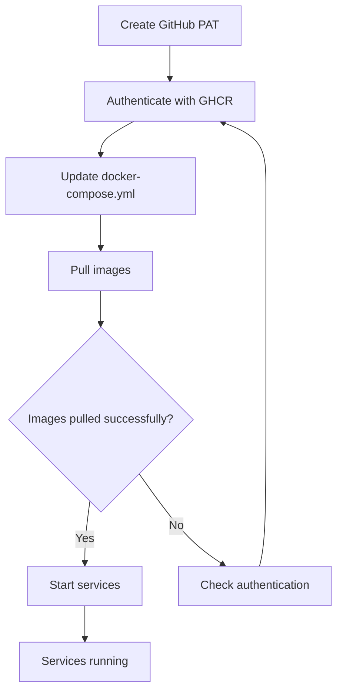

# Smartoys GHCR Update - Implementation Plan

## Overview

Update the Smartoys docker-compose.yml to use custom Mautic images from GitHub Container Registry (GHCR).

## Decisions Made

✅ **Image Tag**: `ghcr.io/smartoys/mautic-stack:7.0.1-apache`  
✅ **Visibility**: Private (requires authentication)  
✅ **Services to Update**: mautic_web, mautic_cron, mautic_worker

## Implementation Changes

### 1. Docker Compose File Updates

**File**: [`examples/smartoys/mautic/docker-compose.yml`](../examples/smartoys/mautic/docker-compose.yml)

**Changes Required**:

#### Service: mautic_web (Line 22)
```yaml
# BEFORE:
image: mautic/mautic:7.0.1-apache

# AFTER:
# Custom Mautic image from https://github.com/Smartoys/mautic-stack
image: ghcr.io/smartoys/mautic-stack:7.0.1-apache
```

#### Service: mautic_cron (Line 77)
```yaml
# BEFORE:
image: mautic/mautic:7.0.1-apache

# AFTER:
# Custom Mautic image from https://github.com/Smartoys/mautic-stack
image: ghcr.io/smartoys/mautic-stack:7.0.1-apache
```

#### Service: mautic_worker (Line 108)
```yaml
# BEFORE:
image: mautic/mautic:7.0.1-apache

# AFTER:
# Custom Mautic image from https://github.com/Smartoys/mautic-stack
image: ghcr.io/smartoys/mautic-stack:7.0.1-apache
```

### 2. GHCR Authentication Setup

Since the images are **private**, authentication is required before pulling images.

#### Option A: Docker Login (Recommended for Local Development)

```bash
# Create a GitHub Personal Access Token with 'read:packages' scope
# Then authenticate:
echo $GITHUB_TOKEN | docker login ghcr.io -u GITHUB_USERNAME --password-stdin
```

#### Option B: Environment Variable in .env File

Add to [`examples/smartoys/.env`](../examples/smartoys/.env) (if it exists):
```bash
# GitHub Container Registry Authentication
GITHUB_USERNAME=your-github-username
GITHUB_TOKEN=your-personal-access-token
```

Then login before running docker-compose:
```bash
echo $GITHUB_TOKEN | docker login ghcr.io -u $GITHUB_USERNAME --password-stdin
docker compose up -d
```

#### Option C: Using Docker Config (For Production Servers)

On the server, create/update `~/.docker/config.json`:
```json
{
  "auths": {
    "ghcr.io": {
      "auth": "BASE64_ENCODED_USERNAME:TOKEN"
    }
  }
}
```

### 3. Creating GitHub Personal Access Token

1. Go to GitHub Settings → Developer settings → Personal access tokens → Tokens (classic)
2. Click "Generate new token (classic)"
3. Give it a descriptive name (e.g., "GHCR Pull - Smartoys Mautic")
4. Select scopes:
   - ✅ `read:packages` - Download packages from GitHub Package Registry
5. Set expiration (recommended: 90 days or based on your security policy)
6. Generate token and save it securely

### 4. Deployment Workflow



## Complete Implementation Steps

### Step 1: Authenticate with GHCR
```bash
# Set your credentials
export GITHUB_USERNAME="your-username"
export GITHUB_TOKEN="ghp_xxxxxxxxxxxxx"

# Login to GHCR
echo $GITHUB_TOKEN | docker login ghcr.io -u $GITHUB_USERNAME --password-stdin
```

### Step 2: Update Docker Compose File
Update the three image references in [`examples/smartoys/mautic/docker-compose.yml`](../examples/smartoys/mautic/docker-compose.yml):
- Line 22: mautic_web service
- Line 77: mautic_cron service
- Line 108: mautic_worker service

### Step 3: Pull Updated Images
```bash
cd examples/smartoys/mautic
docker compose pull
```

### Step 4: Restart Services
```bash
docker compose up -d
```

### Step 5: Verify Deployment
```bash
# Check running containers
docker compose ps

# Check logs
docker compose logs -f mautic_web
```

## Documentation to Add

### In docker-compose.yml

Add comments above each image line:
```yaml
# Custom Mautic image built from https://github.com/Smartoys/mautic-stack
# Images are private and require GHCR authentication
# To authenticate: echo $GITHUB_TOKEN | docker login ghcr.io -u USERNAME --password-stdin
image: ghcr.io/smartoys/mautic-stack:7.0.1-apache
```

### Create Authentication Guide

Consider creating a README in the smartoys example directory:
**File**: `examples/smartoys/README.md`

```markdown
# Smartoys Mautic Deployment

## GHCR Authentication

This deployment uses custom Mautic images from GitHub Container Registry.

### Setup

1. Create a GitHub Personal Access Token:
   - Go to GitHub Settings → Developer settings → Personal access tokens
   - Create token with `read:packages` scope

2. Authenticate with GHCR:
   ```bash
   echo YOUR_TOKEN | docker login ghcr.io -u YOUR_USERNAME --password-stdin
   ```

3. Deploy:
   ```bash
   cd examples/smartoys/mautic
   docker compose up -d
   ```

## Image Details

- **Repository**: https://github.com/Smartoys/mautic-stack
- **Registry**: ghcr.io/smartoys/mautic-stack
- **Current Version**: 7.0.1-apache
```

## Testing Checklist

- [ ] GHCR authentication successful
- [ ] Images can be pulled from GHCR
- [ ] mautic_web service starts successfully
- [ ] mautic_cron service starts successfully
- [ ] mautic_worker service starts successfully
- [ ] Application is accessible via configured URL
- [ ] Database connection works
- [ ] RabbitMQ connection works
- [ ] Logs show no errors

## Rollback Plan

If issues occur, revert to official Docker Hub images:

```yaml
# Rollback to official images
image: mautic/mautic:7.0.1-apache
```

Then:
```bash
docker compose pull
docker compose up -d
```

## Future Updates

To update to a newer version:

1. Check available tags: https://github.com/Smartoys/mautic-stack/pkgs/container/mautic-stack
2. Update the image tag in docker-compose.yml
3. Pull and restart:
   ```bash
   docker compose pull
   docker compose up -d
   ```

## Security Considerations

- Store GitHub tokens securely (use environment variables or secrets management)
- Rotate tokens regularly (recommended: every 90 days)
- Use tokens with minimal required permissions (`read:packages` only)
- Never commit tokens to version control
- Consider using organization-level deploy tokens for production

## Troubleshooting

### Issue: "unauthorized: authentication required"
**Solution**: Authenticate with GHCR first
```bash
echo $GITHUB_TOKEN | docker login ghcr.io -u $GITHUB_USERNAME --password-stdin
```

### Issue: "pull access denied"
**Solution**: Verify token has `read:packages` scope and user has access to repository

### Issue: "manifest unknown"
**Solution**: Verify the image tag exists in GHCR package registry
