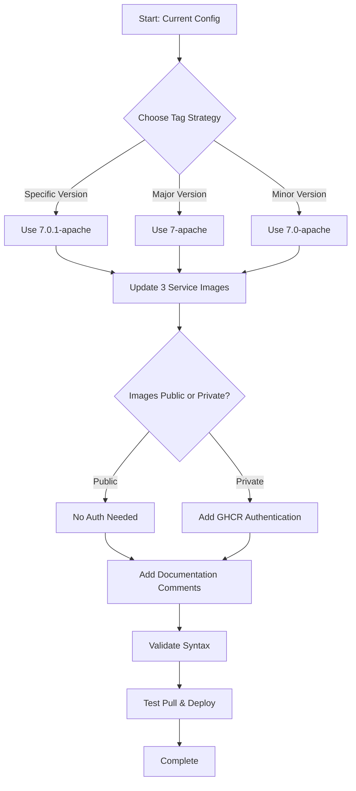

# Plan: Update Smartoys Docker Compose to Use GHCR Images

## Context

The smartoys example currently uses the official Mautic Docker Hub images (`mautic/mautic:7.0.1-apache`). We need to update it to use custom images from GitHub Container Registry (GHCR) that are built by the repository's CI/CD workflow.

## Current State

### Files to Update
- [`examples/smartoys/mautic/docker-compose.yml`](../examples/smartoys/mautic/docker-compose.yml)

### Current Image References
All three Mautic services use the same image:
- **mautic_web** (line 22): `image: mautic/mautic:7.0.1-apache`
- **mautic_cron** (line 77): `image: mautic/mautic:7.0.1-apache`
- **mautic_worker** (line 108): `image: mautic/mautic:7.0.1-apache`

## GHCR Image Details

### Repository
- GitHub Repository: `Smartoys/mautic-stack`
- GHCR Base Path: `ghcr.io/smartoys/mautic-stack`

### Available Tag Patterns
Based on the GitHub workflow configuration, images are tagged with:

1. **Specific Version**: `7.0.1-apache`
2. **Version with Build Date**: `7.0.1-YYYYMMDD-apache` (e.g., `7.0.1-20260326-apache`)
3. **Major Version** (if enabled): `7-apache`
4. **Minor Version** (if enabled): `7.0-apache`
5. **Latest** (if enabled): `latest-apache`

### Image Variant
- **apache** - The workflow currently builds only the Apache variant

## Recommended Approach

### Image Tag Selection

**Option 1: Specific Version Tag (Recommended for Production)**
```yaml
image: ghcr.io/smartoys/mautic-stack:7.0.1-apache
```
- ✅ Predictable and reproducible
- ✅ Explicit version control
- ⚠️ Requires manual updates for new versions

**Option 2: Major Version Tag (Auto-updates within major version)**
```yaml
image: ghcr.io/smartoys/mautic-stack:7-apache
```
- ✅ Automatically gets latest 6.x updates
- ⚠️ May introduce breaking changes within major version
- ⚠️ Only available if workflow is run with `overwrite_latest_major: true`

**Option 3: Minor Version Tag (Auto-updates patch versions)**
```yaml
image: ghcr.io/smartoys/mautic-stack:7.0-apache
```
- ✅ Automatically gets patch updates
- ✅ Less likely to break than major version tag
- ⚠️ Only available if workflow is run with `overwrite_latest_minor: true`

## Implementation Steps

### 1. Choose Image Tag Strategy
Select which tagging strategy best fits the deployment needs.

### 2. Update Docker Compose File
Replace all three image references:
- Update `mautic_web` service
- Update `mautic_cron` service  
- Update `mautic_worker` service

### 3. Consider Authentication
GHCR images can be:
- **Public**: No authentication needed
- **Private**: Requires authentication

If the images are private, add authentication to docker-compose.yml:

```yaml
services:
  mautic_web:
    image: ghcr.io/smartoys/mautic-stack:7.0.1-apache
    pull_policy: always
    # ... rest of config
```

And authenticate before pulling:
```bash
echo $GITHUB_TOKEN | docker login ghcr.io -u USERNAME --password-stdin
```

Or use a `.env` file approach with docker-compose credentials helper.

### 4. Add Documentation Comments
Add comments explaining:
- Why custom images are used
- Where to find the source
- How to update the image version

### 5. Test the Configuration
- Validate docker-compose syntax
- Ensure image can be pulled
- Test service startup

## Potential Considerations

### Image Availability
- Verify the desired tag exists in GHCR
- Check if images are public or private
- Confirm multi-architecture support if needed (workflow builds for linux/amd64 and linux/arm64)

### Pull Policy
Consider adding `pull_policy: always` to ensure latest image is pulled, especially for mutable tags like `7-apache`.

### Image Registry Fallback
If GHCR is unavailable, consider having a fallback strategy or local image cache.

## Mermaid Workflow Diagram



## Questions to Answer

1. Which tag strategy do you prefer?
   - Specific version (e.g., `7.0.1-apache`)
   - Major version (e.g., `7-apache`)
   - Minor version (e.g., `7.0-apache`)

2. Are the GHCR images public or private?
   - Determines if authentication is needed

3. Should we add a pull policy directive?
   - Recommended for mutable tags

## Next Steps

Once the tag strategy is confirmed, the implementation is straightforward:
1. Update the three image references in the docker-compose.yml
2. Add appropriate comments
3. Add authentication config if needed
4. Validate and test
