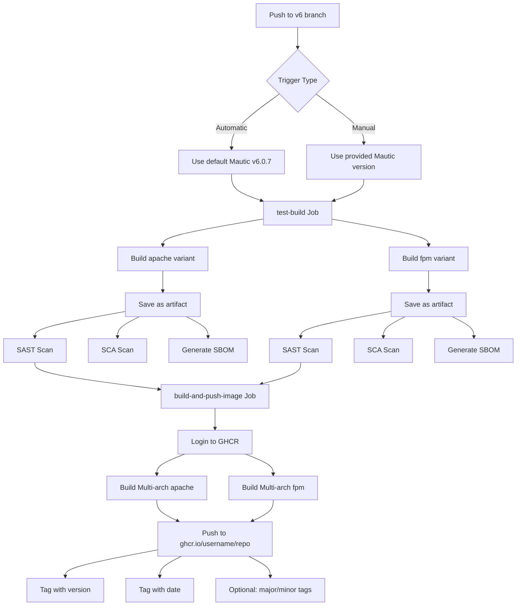
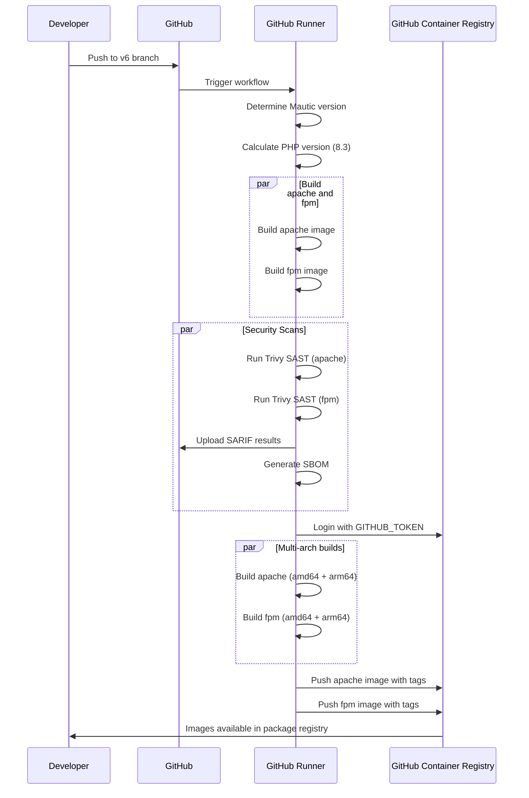

# V6 Branch GHCR Workflow Implementation Plan

## Overview
Update GitHub workflows in your fork of the official Mautic Docker repository to automatically build and publish container images to your private GitHub Container Registry (GHCR) when changes are pushed to the v6 branch.

## Current State Analysis

### Existing Workflow Structure
The repository contains two GitHub workflows:

1. **[`build_publish.yml`](.github/workflows/build_publish.yml)**
   - Triggers: Manual workflow_dispatch only
   - Builds: Both apache and fpm variants
   - Publishes to: Docker Hub AND GHCR
   - Security: Includes SAST (Trivy), SCA, and SBOM generation
   - Multi-arch: Builds for linux/amd64 and linux/arm64

2. **[`pr_test.yml`](.github/workflows/pr_test.yml)**
   - Triggers: Pull requests to main branch
   - Builds: Test builds with hardcoded Mautic 6.0.7
   - Does not publish images

### Key Components
- PHP 8.3 is used for Mautic v6 (configured in phpver step)
- Uses GitHub Actions native permissions for GHCR
- Implements comprehensive security scanning with Trivy
- Separates build, test, and publish stages

## Required Changes

### 1. Update [`build_publish.yml`](.github/workflows/build_publish.yml) Triggers

**Current:**
```yaml
on:
  workflow_dispatch:
    inputs:
      mautic_version:
        description: 'Mautic version (has to be a valid version from `mautic/recommended-project`)'
        required: true
```

**New:**
```yaml
on:
  push:
    branches:
      - v6
  workflow_dispatch:
    inputs:
      mautic_version:
        description: 'Mautic version (has to be a valid version from `mautic/recommended-project`)'
        required: false
        default: '6.0.7'
```

**Changes:**
- Add `push` trigger for v6 branch
- Make `mautic_version` optional with default value
- Keep manual workflow_dispatch for flexibility

### 2. Remove Docker Hub Integration

**Lines to Remove:**
- Line 21: `DOCKERHUB_USERNAME: molluxmollux`
- Lines 179-183: Docker Hub login step
- Line 160: `mautic/mautic` from images list in metadata action

**Modified Sections:**

**Environment variables (lines 19-22):**
```yaml
env:
  REGISTRY: ghcr.io
  IMAGE_NAME: ${{ github.repository }}
```

**Remove Docker Hub login (lines 179-183):**
```yaml
# DELETE THIS STEP
- name: Log in to Dockerhub
  uses: docker/login-action@v3
  with:
    username: ${{ env.DOCKERHUB_USERNAME }}
    password: ${{ secrets.DOCKERHUB_TOKEN }}
```

**Docker metadata (lines 154-171):**
```yaml
- name: Docker meta
  uses: docker/metadata-action@v5
  id: meta
  with:
    # Only publish to GHCR
    images: |
      ${{ env.REGISTRY }}/${{ env.IMAGE_NAME }}
    # generate Docker tags based on the following events/attributes
    tags: |
      type=semver,pattern={{version}},value=${{ inputs.mautic_version }}
      type=raw,value=${{ inputs.mautic_version }}-${{ env.BUILD_DATE }}
      type=semver,pattern={{major}}.{{minor}},value=${{ inputs.mautic_version }},enable=${{ inputs.overwrite_latest_minor }}
      type=semver,pattern={{major}},value=${{ inputs.mautic_version }},enable=${{ inputs.overwrite_latest_major }}
      type=raw,value=latest,enable=${{ inputs.tag_as_latest && matrix.image_type == 'apache' }},suffix=
    flavor: |
      latest=false
      prefix=
      suffix=-${{ matrix.image_type }}
```

### 3. Handle Automatic vs Manual Builds

For automatic builds on v6 branch pushes, we need to handle the case where `mautic_version` input is not provided:

**Add new step after checkout (around line 151):**
```yaml
- name: Determine Mautic version
  id: version
  run: |
    if [ -n "${{ inputs.mautic_version }}" ]; then
      VERSION="${{ inputs.mautic_version }}"
    else
      # For automatic builds, use default version
      VERSION="6.0.7"
    fi
    echo "MAUTIC_VERSION=$VERSION" >> $GITHUB_ENV
    echo "version=$VERSION" >> $GITHUB_OUTPUT
```

**Update all references from `${{ inputs.mautic_version }}` to `${{ env.MAUTIC_VERSION }}`:**
- Line 43: In phpver step computation
- Line 59: In build-args
- Lines 163-166: In metadata tags
- Line 195: In phpver step computation
- Line 210: In build-args

### 4. Update [`pr_test.yml`](.github/workflows/pr_test.yml) Triggers

**Current (lines 5-11):**
```yaml
on:
  pull_request:
    branches:
      - main
    paths:
      - 'Dockerfile'
      - 'common/**'
```

**New:**
```yaml
on:
  pull_request:
    branches:
      - main
      - v6
    paths:
      - 'Dockerfile'
      - 'common/**'
```

**Change:**
- Add `v6` to the list of branches that trigger PR tests

### 5. Tagging Strategy for V6 Branch

When building from v6 branch automatically, the workflow will create the following tags:

**For Mautic version 6.0.7:**
- `ghcr.io/your-username/repo:6.0.7-apache`
- `ghcr.io/your-username/repo:6.0.7-fpm`
- `ghcr.io/your-username/repo:6.0.7-20260103-apache` (with build date)
- `ghcr.io/your-username/repo:6.0.7-20260103-fpm` (with build date)

**Optional tags (when enabled via workflow inputs):**
- `ghcr.io/your-username/repo:6.0-apache` (if overwrite_latest_minor is true)
- `ghcr.io/your-username/repo:6-apache` (if overwrite_latest_major is true)
- `ghcr.io/your-username/repo:latest` (if tag_as_latest is true, apache only)

## GitHub Permissions

### Required Permissions
The workflow already has the correct permissions configured:

**For `build-and-push-image` job (lines 142-144):**
```yaml
permissions:
  contents: read
  packages: write
```

**For `sast` job (lines 78-79):**
```yaml
permissions:
  contents: read
  security-events: write
```

### GITHUB_TOKEN
The default `GITHUB_TOKEN` provided by GitHub Actions has sufficient permissions when:
- Repository settings → Actions → General → Workflow permissions is set to "Read and write permissions"
- Or the specific permissions are granted in the workflow (already done)

No additional secrets are needed for GHCR publishing to your own repository.

## Implementation Steps

### Step 1: Update build_publish.yml workflow
- Modify trigger section to include v6 branch pushes
- Make mautic_version input optional with default value
- Remove DOCKERHUB_USERNAME environment variable
- Remove Docker Hub login step
- Update metadata action to only use GHCR image
- Add version determination step
- Update all version references to use environment variable

### Step 2: Update pr_test.yml workflow
- Add v6 to the branches that trigger PR tests

### Step 3: Test the workflow
- Push a commit to v6 branch
- Verify automatic build triggers
- Check that images are published only to GHCR
- Test manual workflow_dispatch with custom version
- Verify security scanning still works

### Step 4: Update default Mautic version as needed
- When new Mautic 6.x versions are released
- Update the default version in workflow_dispatch input
- Update the fallback version in the version determination step

## Architecture Diagram



## Workflow Execution Flow



## Security Considerations

1. **GHCR Access**: Images will be private by default. Configure package visibility in repository settings.

2. **Trivy Scanning**: Security vulnerabilities are scanned but won't fail the build (exit-code: '0'). Review SARIF results in Security tab.

3. **SBOM Generation**: Software Bill of Materials is generated and attached to published images for supply chain security.

4. **Provenance**: Build provenance metadata is included with published images.

5. **Secrets**: No additional secrets needed beyond default GITHUB_TOKEN for GHCR.

## Post-Implementation Verification

### Verify Workflow Trigger
```bash
# From v6 branch
git commit --allow-empty -m "Test workflow trigger"
git push origin v6
```

### Check Build Status
- Navigate to Actions tab in GitHub
- Verify "Build and publish a Docker image" workflow is running
- Check all jobs complete successfully

### Verify GHCR Images
- Navigate to repository main page
- Click "Packages" in right sidebar
- Verify images are published with correct tags
- Check both apache and fpm variants exist

### Test Manual Dispatch
- Go to Actions → Build and publish a Docker image
- Click "Run workflow"
- Select v6 branch
- Enter custom Mautic version (e.g., 6.0.6)
- Run workflow and verify custom version is used

### Pull and Test Image
```bash
# Login to GHCR
echo $GITHUB_TOKEN | docker login ghcr.io -u USERNAME --password-stdin

# Pull image
docker pull ghcr.io/username/repo:6.0.7-apache

# Run test container
docker run --rm ghcr.io/username/repo:6.0.7-apache php --version
```

## Future Enhancements

1. **Automated Version Detection**: Parse latest Mautic v6 version from composer or GitHub releases
2. **Scheduled Builds**: Add cron trigger for weekly/nightly builds
3. **Branch Protection**: Require successful workflow runs before merging PRs
4. **Notification**: Add Slack/email notifications for build failures
5. **Cache Optimization**: Implement layer caching for faster builds
6. **Matrix Strategy**: Add more PHP versions or Debian variants if needed

## Rollback Plan

If issues occur after implementation:

1. **Revert workflow changes**: Use git to restore previous workflow files
2. **Disable workflow**: Disable the workflow in repository settings
3. **Delete packages**: Remove published packages from GHCR if needed
4. **Switch to manual**: Keep only workflow_dispatch trigger until issues resolved

## Summary

This plan updates your forked Mautic Docker repository to:
- ✅ Automatically build on v6 branch pushes
- ✅ Publish only to your private GHCR
- ✅ Remove Docker Hub integration
- ✅ Maintain security scanning (SAST, SCA, SBOM)
- ✅ Support manual builds with custom versions
- ✅ Test PRs targeting v6 branch
- ✅ Build multi-architecture images (amd64, arm64)
- ✅ Use appropriate PHP version (8.3) for Mautic v6

The implementation maintains all security features while simplifying the publishing workflow to focus on your private container registry.
